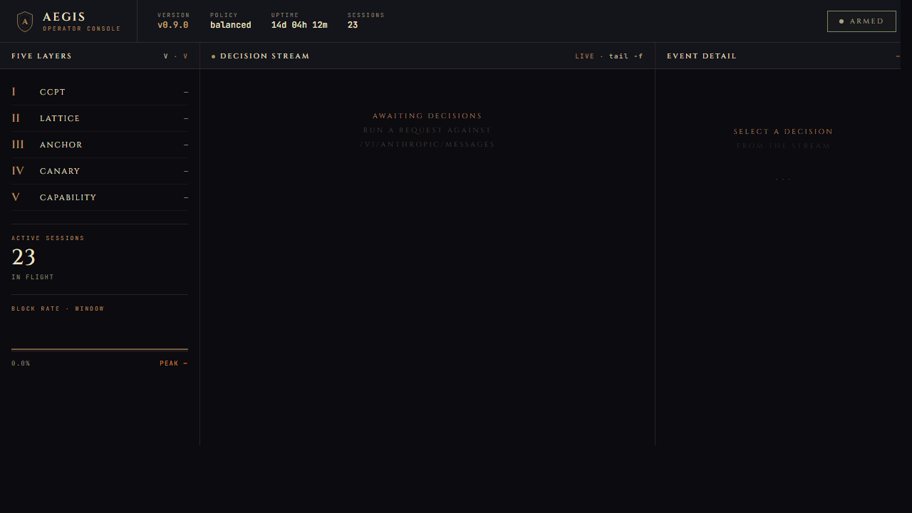
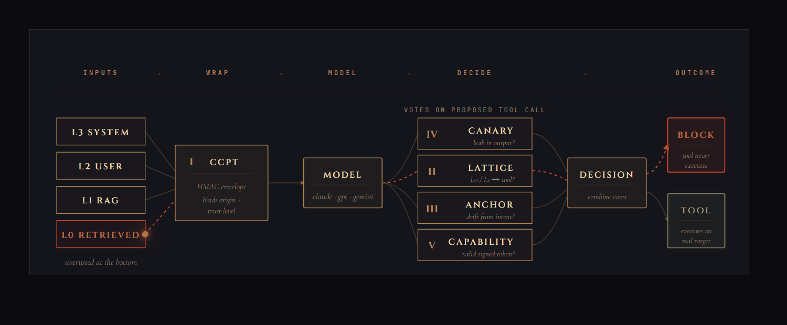
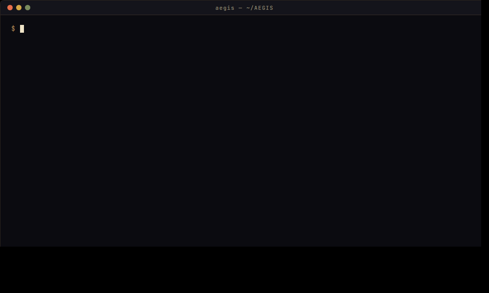

# AEGIS

**Authenticated Execution Gateway for Injection Security.**
*Scvtvm contra iniectionem.*

A personal project exploring what happens when you treat prompt injection as a structural problem instead of a content-classification one. Five composed layers — three structural, two probabilistic — sitting between your agent and the model.

> v1.0.0. See [WHO_SHOULD_USE.md](docs/WHO_SHOULD_USE.md) for whether it's a fit for what you're doing.



The operator console at `/aegis/dashboard`: the five layers (I–V) on the left, live decision stream in the centre, full vote breakdown for the selected request on the right. Hash-chain integrity verified continuously.

## Why this exists

LLMs ingest a single token stream. The boundary between system instructions, user input, retrieved documents, and tool output is a convention enforced by the application layer, not by the model. Defenses based on filtering natural language can be bypassed by sufficiently creative natural language.

I wanted to see what a defense built on cryptographic provenance and capability authorization would actually look like in code. AEGIS is the result. The contribution is the composition; none of the individual ideas are novel.

## Five composed layers

| | Layer | Kind | What it does |
|---|---|---|---|
| **I** | **CCPT** | structural | Every context chunk wrapped in an HMAC-signed envelope binding origin and trust level |
| **II** | **Lattice** | structural | Bell-LaPadula info-flow rules. L0/L1 content cannot authorize tool calls |
| **III** | **Anchor** | probabilistic | User's request is embedded; proposed actions are checked for semantic drift |
| **IV** | **Canary** | probabilistic | Decoy honeytoken instructions in the system prompt; leakage is high-confidence attack evidence |
| **V** | **Capability** | structural | Tool calls require cryptographic, parameter-constrained tokens the model cannot mint |

A Decision Engine combines per-layer ALLOW/WARN/BLOCK votes per a configurable policy. Every decision is recorded in a hash-chained, append-only audit log.



## Sidecar deployment

```
   Your agent
      ↓
   AEGIS proxy (5 layers)
      ↓
   LLM provider
```

Either point your existing OpenAI, Anthropic, or Google client at the AEGIS proxy URL, or use the AEGIS SDK for capability minting and intent declaration.

## Install

Not yet on PyPI / npm. Two equivalent paths.

**pip-from-source** (gets you the CLI and Python SDK locally; works in bash, zsh, cmd, and PowerShell):

```
pip install git+https://github.com/cwellbournewood/aegis@main
aegis genkey > .aegis-master-key
aegis up --port 8080
```

`aegis up` auto-detects `./.aegis-master-key` in the working directory. To use a different location, set `AEGIS_MASTER_KEY_FILE=/path/to/key` (or `AEGIS_MASTER_KEY=<hex>` to pass the key inline).

**Container** (no Python install needed):

```bash
docker run -d --name aegis -p 8080:8080 \
  -e AEGIS_MASTER_KEY="$(openssl rand -hex 32)" \
  ghcr.io/cwellbournewood/aegis:1.0.0
```

For higher-quality drift detection:

```bash
pip install 'aegis-guard[embed] @ git+https://github.com/cwellbournewood/aegis@main'
```

TypeScript SDK (build from source):

```bash
git clone https://github.com/cwellbournewood/aegis
cd aegis/sdk-ts && npm install && npm run build
# then: npm link, or pack and install the resulting tarball
```

## Quickstart

With the proxy running on `:8080`, point an Anthropic client at it via the SDK:

```python
from aegis.sdk import AegisClient
import anthropic

aegis = AegisClient(base_url="http://localhost:8080")

session = aegis.session.create(
    user_intent="summarize my latest invoice email",
    upstream="anthropic",
)
session.capabilities.mint(
    "read_email",
    constraints={"folder": {"kind": "eq", "value": "inbox"}},
)

claude = anthropic.Anthropic(base_url=session.proxy_url, api_key="sk-ant-...")
resp = claude.messages.create(
    model="claude-sonnet-4-5",
    max_tokens=512,
    messages=[{"role": "user", "content": "summarize my latest invoice email"}],
    extra_body={"aegis": {"session_id": session.session_id, "capability_tokens": session.capability_tokens()}},
)
```

For Claude Code, Cursor, or other MCP-using agents, also wrap your MCP servers:

```bash
claude mcp add github "aegis mcp-wrap --policy strict -- npx @modelcontextprotocol/server-github"
```

Full deployment cases in [docs/QUICKSTART.md](docs/QUICKSTART.md).

## CLI



```bash
aegis up                         # start the proxy
aegis down                       # stop a running proxy (PID file, or --port fallback)
aegis status                     # health, version, uptime
aegis logs tail | show <id> | query --since 1h --decision BLOCK | export
aegis sessions list | show <id>
aegis policy validate | show | explain --decision-id <req>
aegis verify <log-path>          # verify hash chain + tip pointer
aegis bench                      # adversarial corpus benchmark
aegis bench-perf                 # latency / throughput
aegis genkey                     # 32-byte hex master key
aegis mcp-wrap -- <mcp-cmd>      # wrap an MCP server
```

## Configuration

```yaml
mode: balanced  # strict | balanced | permissive

flows:
  - { from: L0, to: tool_call, decision: BLOCK }
  - { from: L1, to: tool_call, decision: WARN }
  - { from: L2, to: tool_call, decision: ALLOW, require: [capability_token] }
  - { from: L3, to: tool_call, decision: ALLOW }

anchor:
  threshold_balanced: 0.22
  threshold_strict: 0.40
  embedder: { kind: hashing, dim: 384 }

canary:
  enabled: true
  count: 3

capability:
  default_ttl_seconds: 600
  nonce_store: { kind: memory }   # or redis for multi-replica HA

log_path: ./aegis-decisions.log
```

Full annotated default in [`aegis/policies/default.yaml`](aegis/policies/default.yaml).

| Variable | Purpose |
|---|---|
| `AEGIS_MASTER_KEY` | Hex-encoded 32-byte master key (HKDF root for per-session keys) |
| `AEGIS_MASTER_KEY_FILE` | Path to a file containing the master key |
| `AEGIS_POLICY_PATH` | Path to a policy YAML |
| `AEGIS_ANTHROPIC_URL` / `AEGIS_OPENAI_URL` / `AEGIS_GOOGLE_URL` | Override upstream URLs |
| `AEGIS_DRY_RUN=1` | Don't forward upstream; return synthetic responses |

## Supported providers

| Provider | Wire format |
|---|---|
| Anthropic Claude 3.5+ / Claude 4 | Messages API + streaming |
| OpenAI GPT-4o / GPT-4.1 / GPT-5 | Chat Completions + streaming |
| Google Gemini 1.5+ / 2.x | `generateContent` |

Open-weights, Ollama, and vLLM are not yet supported.

## Performance

| Metric | Measured (idle, hashing embedder) |
|---|---|
| Added p50 latency | 0.07 ms (simple) / 0.10 ms (1 tool call) / 0.25 ms (4 tool calls) |
| Added p99 latency | 0.13 ms / 0.28 ms / 0.49 ms |
| Throughput | >12,000 req/s |
| Token overhead | ~80 tokens / session |

Numbers from `aegis bench-perf` on a Windows local box. CI-asserted regression tests run on every commit at 3x slack.

## Adversarial benchmark

`aegis bench --mode balanced` against the bundled adversarial corpus:

```
| category    | attempts | blocked | warned | allowed | block rate |
|-------------+----------+---------+--------+---------+------------|
| direct      |        4 |       4 |      0 |       0 |     100.0% |
| indirect    |        8 |       7 |      0 |       1 |      87.5% |
| memory      |        3 |       3 |      0 |       0 |     100.0% |
| multi-agent |        2 |       2 |      0 |       0 |     100.0% |
| benign      |        4 |       0 |      0 |       4 |       0.0% |
```

The single allowed indirect case is an explicit test that the policy correctly leaves an L2-origin tool call alone when capability and intent both line up. Benign corpus has zero false positives at `balanced`. Full output and a strict-mode run live in [docs/proof/](docs/proof/).

## Streaming

```
POST /v1/anthropic/messages/stream
POST /v1/openai/chat/completions/stream
```

Each chunk is canary-scanned as it arrives. A leak triggers an immediate `aegis_blocked` SSE event before the offending chunk reaches the client. End-of-stream runs the full pipeline.

## Observability

`GET /metrics` returns Prometheus exposition with request counters by upstream and decision, per-layer vote counts, canary leak counter, capability lifecycle counters, end-to-end and per-gate latency histograms, plus active-sessions and log-entries gauges.

`GET /aegis/dashboard` is a single-page operator UI: live decision stream, block-rate sparkline, per-layer ALLOW/BLOCK bars, top blocked tools.

## Security properties

These are technical properties verifiable from source and tests:

- HMAC keys derived per-session from a master key via HKDF-SHA256.
- Decision log is append-only and hash-chained. `aegis verify <log>` checks integrity end-to-end.
- Model API keys are not persisted; they pass through to the upstream provider.
- CCPT envelopes are stripped before content reaches the model.
- Canary tokens are cryptographically random per-session, with multiple template variants.
- Capability tokens are single-use and time-bounded by default.
- All cryptography uses vetted libraries (`cryptography` for Python, `node:crypto` for TS).

## What AEGIS is not

- Not a model. No alignment, no RLHF.
- Not a WAF. Only inspects the LLM API path.
- Not a substitute for least-privilege tool design; it complements it.
- Not zero false-negative. The goal is to raise attacker cost dramatically while keeping false positives manageable.

## Supply-chain verification

Each tagged release ships a multi-arch image, a cosign keyless signature, a SLSA build-provenance attestation, and an SPDX SBOM.

```bash
# Verify the image was built by this repo's release workflow.
cosign verify ghcr.io/cwellbournewood/aegis:1.0.0 \
  --certificate-identity-regexp='https://github.com/cwellbournewood/aegis/.+' \
  --certificate-oidc-issuer=https://token.actions.githubusercontent.com

# Verify SLSA provenance.
gh attestation verify --owner cwellbournewood \
  oci://ghcr.io/cwellbournewood/aegis:1.0.0
```

SBOMs (SPDX) are attached to each GitHub Release and as cosign SBOM attestations on the image.

## Documentation

- [Quickstart](docs/QUICKSTART.md): three deployment cases with copy-paste code
- [Who should use it](docs/WHO_SHOULD_USE.md): fit check
- [Interfaces](docs/INTERFACES.md): end user, SDK, CLI, dashboard, audit log
- [Architecture](docs/ARCHITECTURE.md): the five layers, decision pipeline, and implementation
- [Operator guide](docs/OPERATOR.md): deployment, tuning, observability
- [Contributing](CONTRIBUTING.md): code style, evaluation criteria
